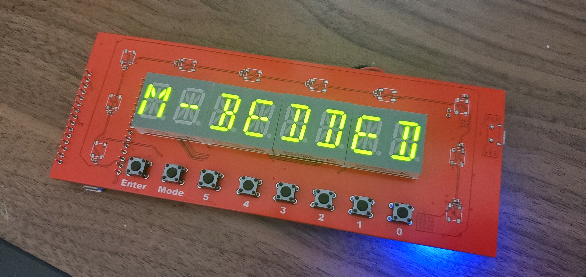
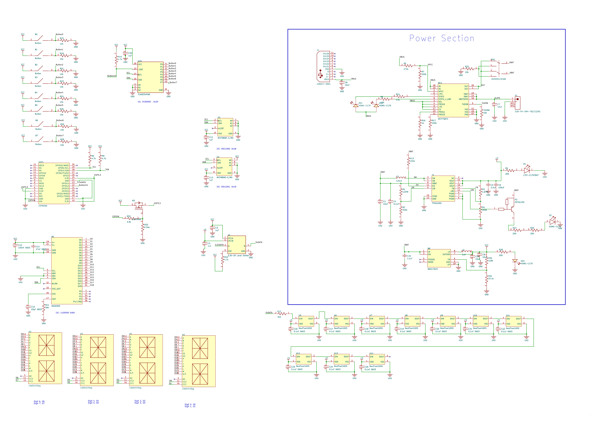
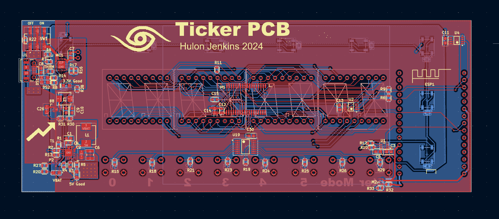

# ESP32 14-Segment Display Clock & Info Panel

A custom-built ESP32-based project using 14-segment hex displays to show real-time data like a clock, stock prices, temperature, and a chess timer.

## What It Does
- Pulls real-time data via Wi-Fi
- Displays info on 8 14-segment displays
- Controlled with 7 physical buttons
- Runs on battery with power management

## Current Modes
- Temperature from 2 i2c sensors
- Real time clock accurate to ~1 second
- Stock Price for any ticker symbol you input
- Chess clock with 5 differet base times and increment

## Photos
Finished Board!

Shows live temperature readings in [temperature testing video](Photos/TempTesting.mp4)

Schematic and Layout

## Code Overview
Firmware is written in C++ and manages:
- I2C communication with display drivers
- GPIO input from buttons
- Wi-Fi data fetching
- State switching between display modes

## 📚 Notes
I designed and built this project as a personal challenge to deepen my embedded systems skills. Though no schematics are available, the board and code were developed from scratch, and photos illustrate the final product.

## 📝 License
MIT
